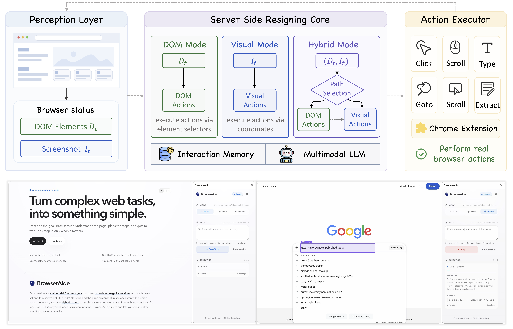

<div align="center">


<h3>An agentic framework for multimodal web automation,<br>implemented as a ready-to-use Chrome extension.</h3>

<p>
  <a href="#demo-video"></a>
  <a href="docs/PROTOCOL.md"></a>
  <a href="LICENSE"></a>
</p>

<p>
  <a href="#overview">Overview</a> /
  <a href="#key-features">Key Features</a> /
  <a href="#architecture">Architecture</a> /
  <a href="#quick-start">Quick Start</a> /
  <a href="#citation">Citation</a>
</p>

<!--  -->

</div>

## Overview

BrowserAide is a multimodal browser automation agent for completing open-ended web tasks from natural-language instructions. It observes the current page, builds a multimodal context from screenshots and DOM elements, asks a vision-language model (VLM) to plan the next action, executes the action in Chrome, and updates its memory for the next step.

The system combines two complementary grounding signals:

- **DOM grounding** for precise interaction with structured web elements.
- **Visual grounding** for screenshots, custom widgets, canvas, PDF, WebGL, and visually ambiguous pages.
- **Hybrid control** as the default mode, allowing the model to choose the most reliable grounding path at each step.

## Key Features

- **Ready-to-use Chrome extension** with task input, mode switching, settings, execution logs, and human handoff.
- **DOM / Visual / Hybrid modes** for standard pages, visual-only interfaces, and mixed real-world websites.
- **FastAPI VLM backend** for prompt construction, streaming responses, action parsing, and session management.
- **Strict action protocol** that validates model outputs before executing browser actions.
- **Reusable research artifact** with protocol documentation in `docs/PROTOCOL.md` and lightweight tests under `server/tests`.

## Architecture

<p align="center">
  
</p>

```text
Chrome extension StepRequest
  -> FastAPI AgentContext
  -> VLM ModelStepOutput JSON
  -> ActionParser normalized actions
  -> StepResponse
  -> Browser execution and feedback
```

## Demo Video

<p align="center">
  <a href="https://youtu.be/OAwME-0Uhpc">
    
  </a>
</p>

<p align="center">
  <a href="https://youtu.be/OAwME-0Uhpc"><strong>Watch the BrowserAide demo on YouTube</strong></a>
</p>

## Quick Start

### Prerequisites

- Git
- Chrome or another Chromium-based browser
- Docker Desktop with Docker Compose, or Python 3.11+
- An OpenAI-compatible multimodal model endpoint and API key

### 1. Clone the repository

```bash
git clone https://github.com/lnennnn/BrowserAide.git
cd BrowserAide
```

### 2. Configure the VLM endpoint

```bash
cp .env.example .env
```

Edit `.env` with your OpenAI-compatible multimodal model endpoint:

```bash
VLM_API_KEY=your-api-key
VLM_BASE_URL=https://your-openai-compatible-endpoint
VLM_MODEL_NAME=your-model-name
SERVER_PORT=8004
BROWSER_CONTROL_MODE=hybrid
```

The backend reads this file when it starts. `BROWSER_CONTROL_MODE` can be `dom`, `visual`, or `hybrid`; `hybrid` is recommended for general use.

### 3. Start the backend

Use Docker Compose:

```bash
docker compose up --build
```

Or run locally:

```bash
python -m venv .venv
source .venv/bin/activate
pip install -r server/requirements.txt
cd server
uvicorn main:app --host 127.0.0.1 --port 8004 --reload
```

The backend listens at `http://127.0.0.1:8004` by default.

Verify that the server is running:

```bash
curl http://127.0.0.1:8004/health
```

### 4. Load the Chrome extension

1. Open `chrome://extensions/`.
2. Enable **Developer mode**.
3. Click **Load unpacked**.
4. Select `BrowserAide/extention`.
5. Pin or open the BrowserAide extension.

The extension calls the backend at `http://127.0.0.1:8004`. If you change `SERVER_PORT`, update `Config.SERVER_URL` in `extention/background.js` before loading the extension.

### 5. Set model options in the extension

1. Open BrowserAide.
2. Go to **Settings > Model**.
3. Enter the same API key, base URL, and model name used in `.env`, or leave these fields empty to use the backend environment variables.
4. Click the endpoint test control to confirm the VLM endpoint is reachable.

### 6. Run a task

1. Open a normal webpage in Chrome.
2. Open the BrowserAide side panel.
3. Enter a natural-language task, such as `Summarize this page in three bullet points`.
4. Choose `hybrid` mode unless you specifically want DOM-only or visual-only control.
5. Start the task and watch the execution log for model thoughts, actions, and final output.

## Control Modes

| Mode | When to use | Actions |
| --- | --- | --- |
| `dom` | Standard pages with reliable DOM structure | `dom_click`, `dom_type`, `dom_select`, `dom_hover` |
| `visual` | Canvas, PDF, WebGL, image-heavy pages, or custom widgets | `click`, `type`, `hover` |
| `hybrid` | General use and paper demonstrations | DOM actions + visual actions |

Common actions available in all modes: `scroll`, `goto`, `back`, `wait`, `extract_page_text`, `call_user`, and `finish`.

## Example Tasks

```text
Read this page and summarize the most important information.
Compare the plans on this page and list their main differences.
Fill out the form using the information I provide.
Find the setup instructions on this documentation page.
Extract the key information from this page into a concise table.
```

## License

This project is released under the [MIT License](LICENSE).
